# 📸 Instagram Lead Scraper - n8n Workflow

Automatically collect Instagram leads based on **profession** and **location**, structure their data (followers, handle, bio, etc.), and store it in **Airtable** — all without coding.

---

## 🚀 Features

* 🔍 Search for Instagram users based on **profession** and **location**
* 🌐 Uses web search (via API) to find Instagram profiles
* 🧠 Parses and structures profile data (followers, handle, bio, etc.)
* 📊 Saves qualified leads to **Airtable** with clean formatting
* 📝 Simple input form via `FormTrigger` node
* ⏳ Includes delay to avoid rate-limiting
* ⚙️ Fully customizable and no database required

---

## 🧰 Nodes Overview

| Node             | Description                                                           |
| ---------------- | --------------------------------------------------------------------- |
| **FormTrigger**  | User submits profession + location (e.g., "photographer" + "Neemuch") |
| **HTTP Request** | Sends the search query to your **Amplify API**                        |
| **Wait**         | Brief delay before parsing (optional)                                 |
| **Code**         | Parses search results, extracts and cleans Instagram data             |
| **Airtable**     | Saves structured lead data to a specified base and table              |
| **Sticky Notes** | Visual organization of workflow stages                                |

---

## 🛠️ Requirements

* [n8n](https://n8n.io/)
* Amplify or similar search API key (replace in HTTP node)
* Airtable base + token
* Basic understanding of workflows

---

## 🔧 Setup Instructions

1. **Install n8n** (Cloud or Self-Hosted)
2. **Import the workflow JSON** into your n8n editor
3. **Update the HTTP Request node**:

   * Replace `enter your aplify API Key` with your actual endpoint or service
   * Adjust query string if needed:

     ```text
     site:instagram.com + {{ $json['who are looking for ?'] }}{{ $json.Location }}
     ```
4. **Configure Airtable credentials**:

   * Set your `Base ID` and `Table ID`
   * Add your Airtable Personal Access Token
5. **Publish the workflow**

---

## 🧠 How it Works (Flow)

```mermaid
graph LR
A[📝 User submits form] --> B[🌍 HTTP Request to Amplify]
B --> C[⏳ Wait briefly]
C --> D[📦 Parse + Structure via Code node]
D --> E[📅 Send to Airtable]
```



---

## 📆 Sample Output to Airtable

| Name   | Username      | Insta URL                                                                 | Description                        | Followers |
| ------ | ------------- | ------------------------------------------------------------------------- | ---------------------------------- | --------- |
| Gaurav | kalki\_clicks | [https://instagram.com/kalki\_clicks](https://instagram.com/kalki_clicks) | Diploma In Photography, Freelancer | 270       |

---

## 🛠 Customize

* 💬 **Change query structure** in HTTP Request for broader or narrower searches
* 🔄 **Integrate with Google Sheets** instead of Airtable
* 🖟️ Add filters for min. followers or keyword presence in description
* 💡 Add notifications (email, Slack, etc.) when new leads are added

---

## 📩 Contact

Need help or want to integrate more features?
Drop a mail at: `mithlohar1@gmail.com`

---

## ✅ To-Do

* [ ] Add pagination for deeper scraping
* [ ] Auto DM leads using IG automation
* [ ] Schedule recurring search jobs
* [ ] Add duplicate filtering

---

## License

MIT — Use this for personal or commercial projects.
